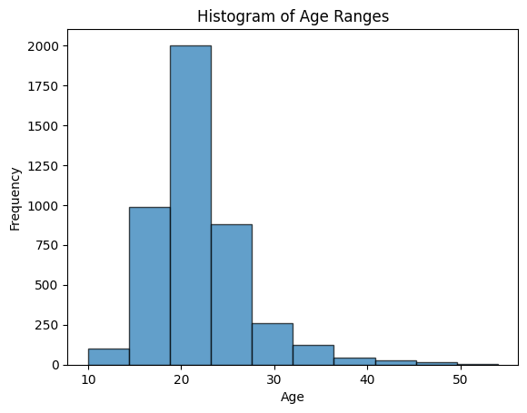
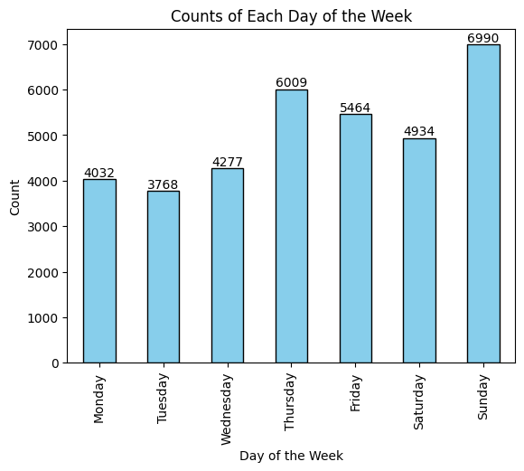
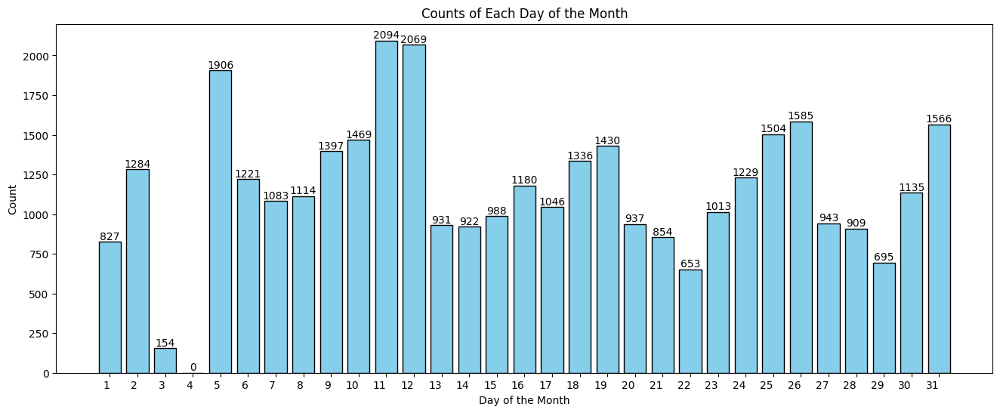
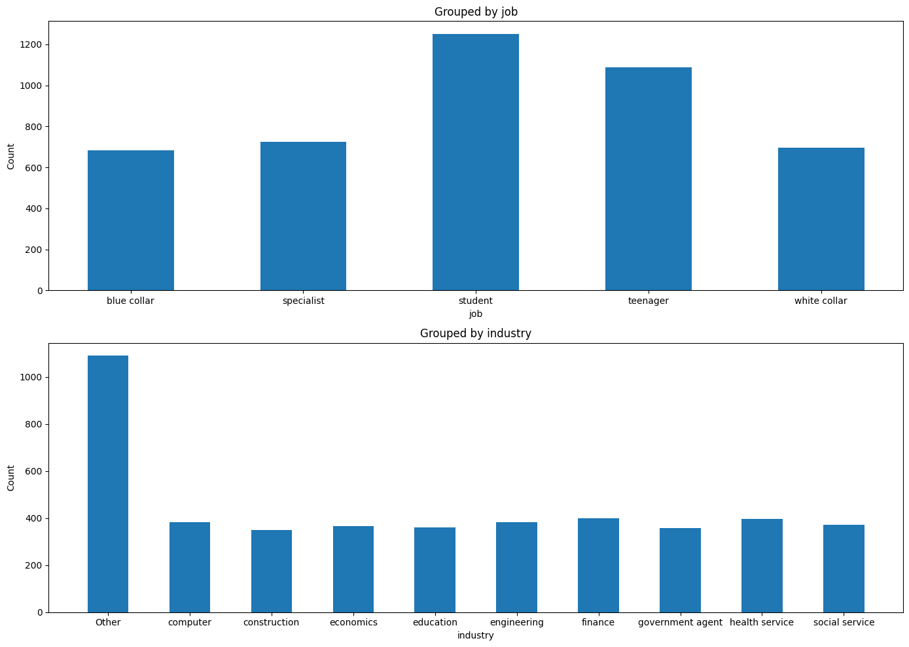
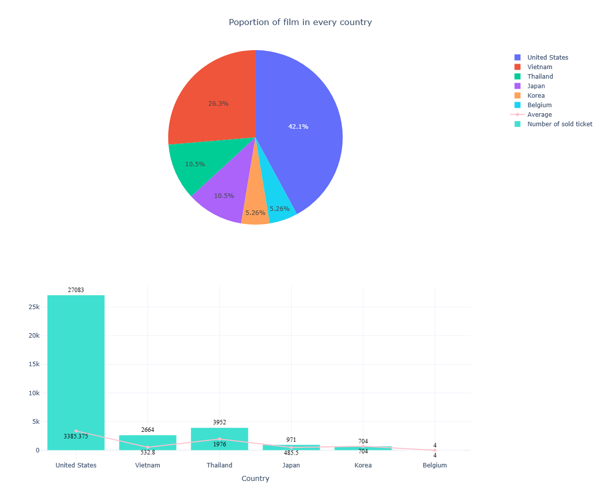
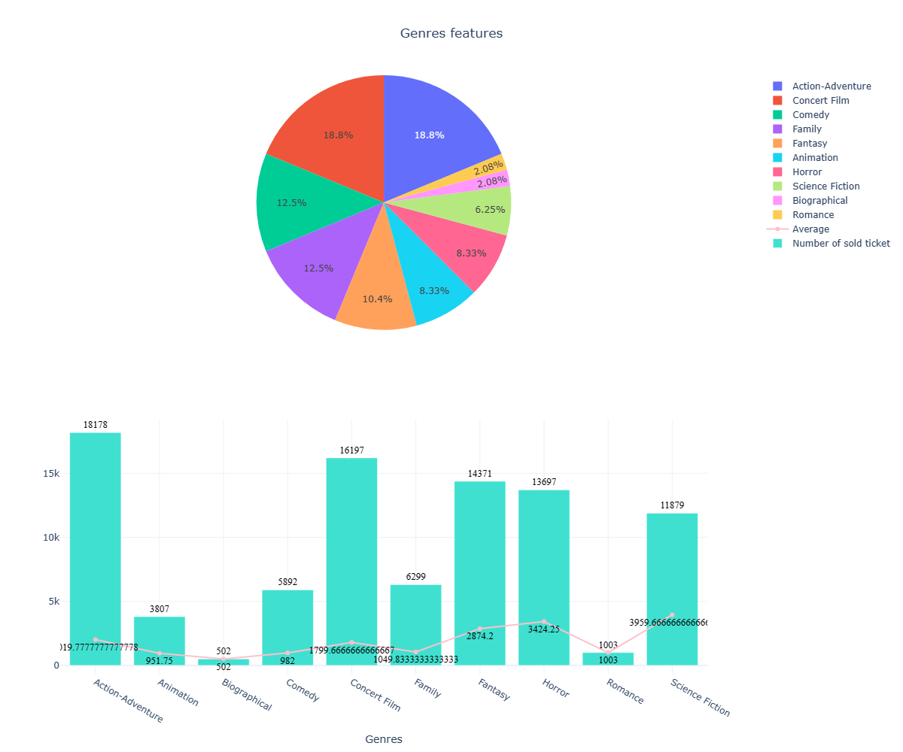
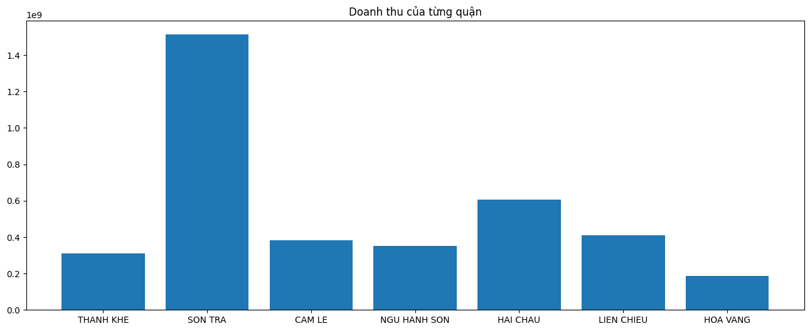

# Cuộc thi Data Gotalent

## I. Thông tin nhóm:

- **Trường:** Trường Đại học Khoa học Tự nhiên- Đại học Quốc gia Thành phố Hồ Chí Minh
  
    Mã số sinh viên|Họ và tên|Số điện thoại
    -|-|-
    21127684|Kuo Young Sheng|0904098763 
    21127471|Nguyễn Hoàng Anh Tuấn|0913776073
    21127687|Phan Huy Đức Tài|0913003511
    21127605|Dương Gia Hân|0397774304
    21127351|Hồ Đinh Duy Lực|0877731725

## II. Thông tin dự án:
### 1. Bộ dữ liệu:
- Nội dung: Bộ dữ liệu ghi nhận thông tin về các khách hàng và lịch sử xem phim của các cụm rạp chiếu phim khắp thành phố Đà Nẵng.
- Nguồn: Bộ Data được cung cấp bởi Ban tổ chức cuộc thi Data Got Talent.

### 2. EDA
#### 2.1 Dữ liệu khách hàng:
| ID | Column | Non-Null Count | Dtype | Meaning |
|----|--------|----------------|-------|---------|
| 0  | customerid | 4479 non-null  | object | Mã khách hàng |
| 1  | DOB        | 4479 non-null  | int64  | Ngày sinh |
| 2  | gender     | 4479 non-null  | object | Giới tính |
| 3  | address    | 4478 non-null  | object | Địa chỉ |
| 4  | Website    | 3943 non-null  | object | Dữ liệu web |
| 5  | job        | 4479 non-null  | object | Công việc |
| 6  | industry   | 3357 non-null  | object | Lĩnh vực |

#### 2.2 Dữ liệu bán vé:

| ID | Column | Non-Null Count | Dtype | Meaning |
|----|--------|----------------|-------|---------|
| 0  | cashier | 35378 non-null | object | Nhân viên thu ngân |
| 1  | saledate | 35378 non-null | datetime64[ns] | Ngày bán |
| 2  | total | 35378 non-null | float64 | Tổng tiền |
| 3  | customerid | 35378 non-null | object | Mã khách hàng |
| 4  | slot | 35378 non-null | object | Suất chiếu |
| 5  | room | 35378 non-null | int64 | Phòng chiếu |
| 6  | film | 35378 non-null | object | Tên phim |
| 7  | slot type | 35378 non-null | object | Loại suất chiếu |
| 8  | ticket price | 35378 non-null | int64 | Giá vé |
| 9  | popcorn | 35378 non-null | object | Bỏng ngô |

#### 2.3 Dữ liệu Phim được chiếu
| ID | Column       | Non-Null Count | Dtype  | Meaning                                              |
|----|--------------|----------------|--------|------------------------------------------------------|
| 0  | show_id      | 60 non-null    | object | Mã định danh phim                   |
| 1  | title        | 60 non-null    | object | Tên bộ phim                                 |
| 2  | director     | 50 non-null    | object | Tên đạo diễn bộ phim                 |
| 3  | cast         | 54 non-null    | object | Các diễn viên tham gia chương trình         |
| 4  | country      | 53 non-null    | object | Các quốc gia tham gia sản xuất phim |
| 5  | release_year | 60 non-null    | int64  | Năm phát hành chương trình                  |
| 6  | rating       | 59 non-null    | object | The age rating of the show                           |
| 7  | duration     | 60 non-null    | object | Độ dài chương trình(phút) hoặc mùa        |
| 8  | listed_in    | 60 non-null    | object | Thể loại chương trình                  |
| 9  | description  | 60 non-null    | object | Giới thiệu chương trình                       |

#### 2.4 Dữ liệu phim được thu thập thêm

| #   | Column       | Non-Null Count | Dtype  | Ý nghĩa                                             |
|----|--------------|----------------|--------|------------------------------------------------------|
| 0  | film         | 19 non-null    | object | Tên của bộ phim                                      |
| 1  | count        | 19 non-null    | int64  | Số lượng vé bán ra của bộ phim                        |
| 2  | cast         | 19 non-null    | object | Danh sách các diễn viên  trong bộ phim |
| 3  | country      | 19 non-null    | object | Quốc gia hoặc các quốc gia sản xuất bộ phim           |
| 4  | release_year | 19 non-null    | int64  | Năm phát hành của bộ phim                            |
| 5  | rating       | 19 non-null    | object | Đánh giá độ tuổi của bộ phim                         |
| 6  | duration     | 19 non-null    | object | Thời lượng của bộ phim theo phút            |
| 7  | listed_in    | 19 non-null    | object | Thể loại hoặc các thể loại của bộ phim                |
| 8  | description  | 19 non-null    | object | Tóm tắt cốt truyện của bộ phim                       |
| 9  | Link         | 19 non-null    | object | Đường dẫn đến trang web thu thập thông tin           |

### 3. Phân tích vấn đề và đề xuất giải pháp 
#### **a. Vấn để 1:** Đối tượng khách hàng của hãng đang có sự phân bố như thế nào? Thị hiếu của người xem hiện tại(2019) ra sao?  

**Lợi ích:** Thông tin này có thể hữu ích cho các nhà làm phim và hãng phim điều chỉnh chiến lược tiếp thị và phân phối nhằm tối đa hóa phạm vi tiếp cận và doanh thu của họ. Ví dụ: họ có thể tập trung vào việc quảng bá các thể loại được khán giả trong nước phổ biến hơn và phân bổ nguồn lực phù hợp. Họ cũng có thể cân nhắc khám phá các kỹ thuật tiếp thị mới và độc đáo để thu hút nhiều người xem hơn và tạo tiếng vang cho phim. Ngoài ra, bộ phận kinh doanh có thể tiến hành nghiên cứu thị trường để xác định đối tượng mục tiêu cho phim của mình và tạo nội dung phù hợp với họ. Bằng cách đó, họ có thể tăng cơ hội thành công trong ngành dịch vụ đầy cạnh tranh.

**Cách trả lời câu hỏi:**

Bước 1: Phân tích, thống kê các số liệu về phân phối của khách hàng theo `độ tuổi`, `nghề nghiệp`, `lĩnh vực`. Phân tích `thời gian` khách hàng xem phim theo ngày trong tuần, trên tháng... Đòng thời ghi nhận những `đối tượng có đóng gớp lớn` cho doanh thu rạp phim.  

  
   

  
  

     

  
Bước 2: Phân tích xu hướng phim ảnh mà các khách hàng quan tâm theo `diễn viên`, `thể loại` và `quốc gia`. Đồng thời, điều tra yếu tố `phân loại độ tuổi` có ảnh hưởng đến khách hàng hay không.  

  
   

Bước 3: Kết hợp với yếu tố địa lý để tìm ra đặc trưng của từng quận, huyện ở TP Đà Nẵng.  

  

Bước 4: Phân tích và đưa ra chiến lược phát triển.

  

**&rarr; Trả lời câu :** 
Về vấn đề đầu tiên, cụ thể là về dữ liệu khách hàng. Có thể thấy hầu hết là giới trẻ, phân khúc khách hàng này sử dụng mạng xã hội nhiều. Khi quảng cáo phim mới ta nên chú trọng và online marketing thông qua các mạng xã hội. Theo nguồn thông tin này cho ta biết các mạng xã hội có nhiều người dùng nhất, lần lượt là: Facebook, Youtube, Whatsapp, TikTok, ... Tiếp đến là dữ liệu phim ảnh, cụm rạp có thể xem xét việc nhận bản quyền chiếu các bộ phim thuộc thể loại mang lại nhiều doanh thu như kinh dị, hành động, khoa học viễn tưởng, … và tập trung các chiến dịch quảng cáo và các ưu đãi đối với các bộ phim này. Ngoài ra, các rạp cũng nên tập trung phát triển cơ sở vật chất ở các rạp thuộc những nơi mang lại lợi nhuận cho hệ thống rạp.

#### **b. Vấn để 2:** Khách hàng có những sở thích như thế nào về chỗ ngồi? Đâu là phương pháp để việc kinh doanh bỏng ngô phát triển?  
**Lợi ích:** Trong thời gian gần đây, trải nghiệm người dùng đã trở thành một yếu tố quan trọng và được khách hàng đánh giá cao khi sử dụng dịch vụ. Khách hàng ngày càng mong đợi một trải nghiệm cá nhân hóa, đáp ứng nhu cầu và sở thích của họ một cách tốt nhất. 

**Cách trả lời câu hỏi:**  
Bước 1: Phân tích xu hướng lựa chọn `vị trí ngồi`.    

   

Bước 2: Phân tích xu hướng `mua bỏng ngô` của người đi xem phim.    
Bước 3: Phân tích và đưa ra chiến lược phát triển.  

**&rarr; Trả lời câu :** 
Đối với những cải thiện cho trải nghiệm người dùng, nhóm có một số đề xuất như sau: 
Dịch vụ chăm sóc khách hàng:
Cung cấp dịch vụ chăm sóc khách hàng tận tình và chuyên nghiệp cho khách ngồi ở dãy ghế F, E, G. Điều này bao gồm việc hướng dẫn, hỗ trợ và giải đáp mọi thắc mắc của họ để tạo ra trải nghiệm xem phim thuận lợi và thú vị.  
Đảm bảo rằng dãy ghế này luôn sạch sẽ và thoải mái bằng cách kiểm tra và bảo trì định kỳ.  
Giảm Giá và Ưu Đãi Đặc Biệt:  
Chương trình khuyến mãi độc đáo với slogan "Ngồi ở đầu hàng, ăn bắp ngập tràn, ngồi ở hàng cuối, bắp ăn cắm cúi" đang chờ đón những khách hàng tại các ghế A, B, C, J, K. Nếu bạn là người mua vé đơn, hãy chuẩn bị trải nghiệm tuyệt vời với ưu đãi đặc biệt: mỗi vé kèm theo sẽ được tặng ngay 1 phần bắp nhỏ. Đối với những khách hàng mua từ 2 vé đơn trở lên, chúng tôi sẽ tặng phần bắp thêm, tương đương với số lượng đã mua. Đây là cơ hội lớn để bạn và bạn bè cùng nhau thưởng thức bộ phim yêu thích mà không lo lắng về việc đói bụng. Đồng thời, để tạo thêm hứng thú cho chương trình, nhóm đề xuất thiết kế lại túi đựng bỏng ngô độc đáo, lấy cảm hứng từ một bộ phim đang rất hot. Túi đựng bỏng ngô không chỉ là vật dụng hữu ích mà còn là một phần của trải nghiệm giải trí. Chúng tôi tin rằng, thông qua sự sáng tạo trong thiết kế túi, chúng tôi sẽ tạo ra làn sóng ủng hộ mạnh mẽ từ khách hàng, tăng cường không khí sôi động tại rạp phim và làm nổi bật thương hiệu của chúng tôi trong tâm trí khách hàng.  

Ngoài ra, nhóm cũng đề xuất có một chiến dịch kéo dài 1 đến 3 tháng vào khung giờ từ 12h đến 6h trong đó có nội dung là người nào đi đơn mà mua bỏng ngô sẽ giảm tiền vé lại vào khoản 50%. Điều này sẽ giải quyết vấn đề những người mua vé đơn ít mua bỏng ngô. Việc này có thể tạo thành thói quen cho người đi đơn và về lâu về dài doanh số bán bỏng ngô sẽ tăng với việc bỏng ngô là món hàng mang lại lợi nhuận nhất trong rạp chiếu phim thì việc này hoàn toàn có lợi tuy rằng sẽ có lỗ trong ngắn hạn.  

## III. Tư liệu tham khảo:  
1. [Successful Film Marketing: An In-Depth Guide, Garrett Thierry, Feb 3 2023](https://www.garrett-thierry.com/post/successful-film-marketing-an-in-depth-guide)
